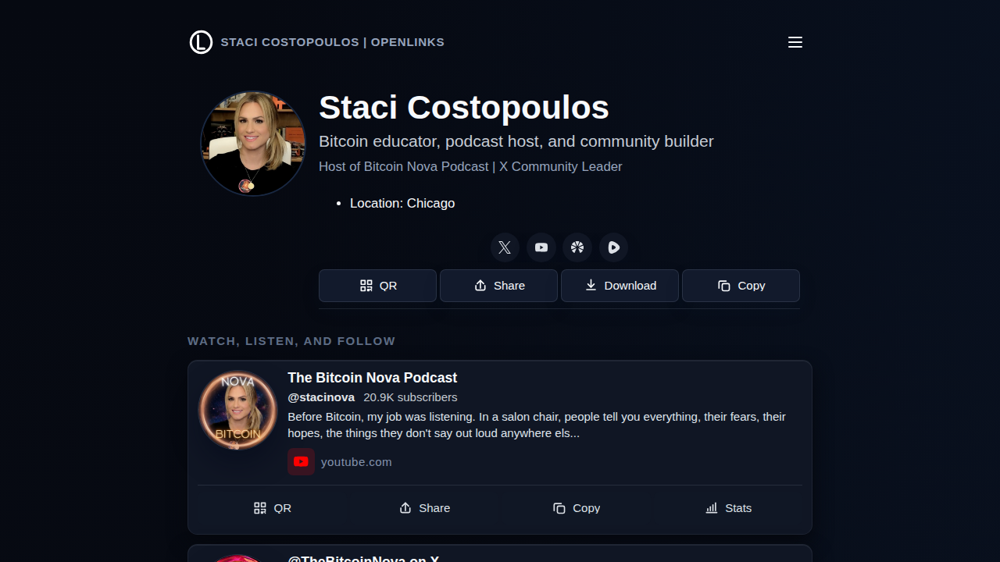

# OpenLinks

[](https://github.com/pRizz/open-links)
[](https://github.com/pRizz/open-links/actions/workflows/ci.yml)
[](https://github.com/pRizz/open-links/actions/workflows/deploy-pages.yml)
[](https://github.com/pRizz/open-links/blob/main/LICENSE)
[](https://github.com/pRizz/open-links/blob/main/.github/workflows/ci.yml)
[](https://www.typescriptlang.org/)
[](https://www.solidjs.com/)
[](https://vite.dev/)

OpenLinks is a personal, free, open source, version-controlled static website generator for social links.

This project is developer-first: fork the repo, edit JSON, push, and publish.
<!-- OPENLINKS_SCREENSHOT_START -->

<!-- OPENLINKS_SCREENSHOT_END -->

## Why OpenLinks

- Static SolidJS site with minimal runtime complexity.
- Version-controlled content in `data/*.json`.
- Schema + policy validation with actionable remediation output.
- Rich and simple card support with build-time enrichment.
- Payments and tips links with multi-rail support, styled QR codes, and fullscreen scan mode.
- Build-time profile-avatar materialization with local fallback behavior.
- Build-time rich/SEO image materialization with local-only runtime behavior.
- GitHub Actions CI + GitHub Pages deploy pipeline already wired.
- Theme and layout controls designed for forking and customization.
- Data-driven typography overrides via `data/site.json` (`ui.typography`).

## Scope and Audience

### Intended audience

- Developers who are comfortable editing JSON and markdown.
- Maintainers using AI agents to automate content updates.

### Out of scope for v1

- User auth/account system.
- CMS or WYSIWYG editor.
- Built-in analytics.
- Plugin marketplace.

## Quickstart

For full walkthrough and troubleshooting, see [Quickstart](https://raw.githubusercontent.com/pRizz/open-links/main/docs/quickstart.md).

### 1) OpenClaw Bootstrap (Recommended)

Paste this one-liner into OpenClaw, Claude, or Codex (the prompts are mostly compatible with any coding agent):

```text
Follow docs/openclaw-bootstrap.md exactly for this repository. Execute Required Execution Policy, End-to-End OpenClaw Sequence, Automation and Identity Confirmation Rule, Social Discovery and Inference Contract, Deployment Verification Contract, Structured URL Reporting Schema, README Deploy URL Marker-Block Contract, and Final Output Contract exactly as written. If an existing setup is detected, ask the single route-confirmation and switch to docs/openclaw-update-crud.md when selected.
```

Use this path when this is the first setup for a new fork or local clone.

### 2) OpenClaw Update/CRUD (Existing Fork or Local Repo)

Paste this one-liner into OpenClaw, Claude, or Codex:

```text
Follow docs/openclaw-update-crud.md exactly for this repository. Execute Required Startup Handshake (including conditional customization-audit selectors), Defaults, Customization Audit Path (Optional), Repository Resolution, Dirty Local Repository Handling, Interaction Modes, Identity and Discovery Policy, Update/CRUD Execution Sequence, Final Output Contract, and Required reason codes exactly as written. When customization_path=customization-audit, use docs/customization-catalog.md as the checklist source.
```

Use this path for day-2 maintenance when the user likely already has a fork and/or local clone.

### 3) Create your own repository (Manual Path)

Use this approach:

1. Fork this repository.

### 4) Clone and install

```bash
git clone <your-repo-url>
cd open-links
bun install
```

If your links use authenticated extractors (`links[].enrichment.authenticatedExtractor`), run guided cache setup before first `dev`/`build`:

```bash
bun run setup:rich-auth
```

### 5) Update your data

Edit these files:

- `data/profile.json` - identity and profile details.
- `data/links.json` - simple/rich/payment links, groups, ordering.
- `data/site.json` - theme, UI, quality, and deployment-related config.

Starter presets:

- `data/examples/minimal/`
- `data/examples/grouped/`
- `data/examples/invalid/` (intentional failures for testing)

### 6) Validate and run locally

```bash
bun run validate:data
bun run dev
```

### 7) Build production output

```bash
bun run build
bun run preview
```

## OpenClaw Deployment URLs

OpenClaw should update only the rows between the exact marker lines below:

- rewrite only marker-bounded rows,
- commit only if normalized URL/status values changed.

OPENCLAW_DEPLOY_URLS_START
| target | status | primary_url | additional_urls | evidence |
|--------|--------|-------------|-----------------|----------|
| github-pages | active | https://prizz.github.io/open-links/ | none | Deploy Pages succeeded for b6340cc |
OPENCLAW_DEPLOY_URLS_END

## AI-Guided Path (Optional)

If you want an AI agent workflow with explicit checkpoints and manual opt-outs, use the [AI-Guided Customization Wizard](https://raw.githubusercontent.com/pRizz/open-links/main/docs/ai-guided-customization.md). For automation-first execution paths, use [OpenClaw Bootstrap Contract](https://raw.githubusercontent.com/pRizz/open-links/main/docs/openclaw-bootstrap.md) for first-time setup and [OpenClaw Update/CRUD Contract](https://raw.githubusercontent.com/pRizz/open-links/main/docs/openclaw-update-crud.md) for day-2 changes.

Recommended flow:

1. Start with [Quickstart](https://raw.githubusercontent.com/pRizz/open-links/main/docs/quickstart.md).
2. Use [Data Model](https://raw.githubusercontent.com/pRizz/open-links/main/docs/data-model.md) while shaping content.
3. Use [Customization Catalog](https://raw.githubusercontent.com/pRizz/open-links/main/docs/customization-catalog.md) for complete day-2 data-driven audits.
4. Run the AI wizard to automate repeatable CRUD updates.

## First GitHub Pages Deploy (Quick Path)

1. Push to `main`.
2. In GitHub repository settings, set Pages source to **GitHub Actions**.
3. Wait for:
   - `.github/workflows/ci.yml` to succeed.
   - `.github/workflows/deploy-pages.yml` to deploy.
4. Open the published Pages URL from the deployment job.

Local parity commands:

```bash
bun run ci:required
bun run ci:strict
```

Then use:

- [Deployment Operations Guide](https://raw.githubusercontent.com/pRizz/open-links/main/docs/deployment.md) for full troubleshooting and diagnostics flow.
- [OpenClaw Bootstrap Contract](https://raw.githubusercontent.com/pRizz/open-links/main/docs/openclaw-bootstrap.md) for deployment URL reporting and README marker-block updates.
- [OpenClaw Update/CRUD Contract](https://raw.githubusercontent.com/pRizz/open-links/main/docs/openclaw-update-crud.md) for existing repo update sessions and interaction-mode behavior.
- [Adapter Contract Guide](https://raw.githubusercontent.com/pRizz/open-links/main/docs/adapter-contract.md) for future non-GitHub host planning.

## OpenLinks Studio (Experimental Control Plane)

This repository now includes a multi-service self-serve control plane for non-technical onboarding and browser-based CRUD edits:

- `packages/studio-web` - marketing + onboarding + editor (Solid + Tailwind + shadcn-solid style components)
- `packages/studio-api` - GitHub auth/app workflows, fork provisioning, content validation/commit, deploy status, sync endpoints
- `packages/studio-worker` - scheduled sync trigger worker
- `packages/studio-shared` - shared contracts

See [docs/studio-self-serve.md](docs/studio-self-serve.md) for local setup, Railway deployment, env variables, and GitHub App setup.
Track implementation phases in [docs/studio-phase-checklist.md](docs/studio-phase-checklist.md).

Studio workspace tooling is Bun-first:

- `bun install`
- `bun run studio:typecheck`
- `bun run studio:lint`
- `bun run studio:format`

High-signal deployment checks:

1. `required-checks` job in `.github/workflows/ci.yml` is green.
2. `deploy` job in `.github/workflows/deploy-pages.yml` is green.
3. Deploy summary includes a published URL.
4. If deploy fails, review workflow summary remediation and diagnostics artifacts.

## Validation and Build Commands

### Core commands

- `bun run avatar:sync` - fetch profile avatar into `public/generated/` and write `data/generated/profile-avatar.json`.
- `bun run enrich:rich` - run non-strict rich metadata enrichment (diagnostic/manual mode) with known-blocker + authenticated-cache policy enforcement.
- `bun run enrich:rich:strict` - run policy-enforced rich metadata enrichment (blocking mode) with known-blocker + authenticated-cache policy enforcement.
- `bun run setup:rich-auth` - first-run authenticated cache setup (captures only missing/invalid authenticated cache entries).
- `bun run auth:rich:sync` - guided authenticated rich-cache capture (updates `data/cache/rich-authenticated-cache.json` + `public/cache/rich-authenticated/*`).
- `bun run auth:rich:clear` - clear authenticated cache entries and unreferenced local assets (selector-driven; supports `--dry-run`).
- `bun run auth:extractor:new -- --id <id> --domains <csv> --summary "<summary>"` - scaffold a new authenticated extractor plugin + policy + registry wiring.
- `bun run linkedin:debug:bootstrap` - LinkedIn debug bootstrap (agent-browser checks + browser binary install check).
- `bun run linkedin:debug:login` - LinkedIn debug login watcher (autonomous auth-state polling; multi-factor authentication optional).
- `bun run linkedin:debug:validate` - LinkedIn authenticated metadata debug validator.
- `bun run linkedin:debug:validate:cookie-bridge` - LinkedIn debug validator with cookie-bridge HTTP diagnostic.
- `bun run images:sync` - fetch rich-card/SEO remote images into `public/generated/images/` and write `data/generated/content-images.json`.
- `bun run dev` - start local dev server (predev runs strict enrichment and fails on blocking enrichment policy issues).
- `bun run validate:data` - schema + policy checks (standard mode).
- `bun run validate:data:strict` - fails on warnings and errors.
- `bun run validate:data:json` - machine-readable validation output.
- `bun run build` - avatar sync + strict enrichment + content-image sync + validation + production build.
- `bun run build:strict` - avatar sync + strict enrichment + content-image sync + strict validation + build.
- `bun run preview` - serve built output.
- `bun run typecheck` - TypeScript checks.

### Authenticated Cache Lifecycle

Canonical paths:

- `data/cache/rich-authenticated-cache.json`
- `public/cache/rich-authenticated/`
- `output/playwright/auth-rich-sync/`

Setup/refresh flow:

- First-run idempotent setup (only missing/invalid cache entries): `bun run setup:rich-auth`
- Targeted refresh: `bun run auth:rich:sync -- --only-link <link-id>`
- Forced refresh (even when cache is already valid): `bun run auth:rich:sync -- --only-link <link-id> --force`

Clear flow:

- Dry run clear for one link: `bun run auth:rich:clear -- --only-link <link-id> --dry-run`
- Apply clear for one link: `bun run auth:rich:clear -- --only-link <link-id>`
- Apply clear for all authenticated cache entries: `bun run auth:rich:clear -- --all`
- Recapture after clear: `bun run setup:rich-auth` (or `bun run auth:rich:sync -- --only-link <link-id>`)

### Quality commands

- `bun run quality:check` - standard quality gate.
- `bun run quality:strict` - strict quality gate.
- `bun run quality:json` - standard quality JSON report.
- `bun run quality:strict:json` - strict quality JSON report.

### CI parity commands

- `bun run ci:required` - required CI checks.
- `bun run ci:strict` - strict CI signal checks.

## Data Contract Rules (High-Level)

### URL schemes

Allowed URL schemes:

- `http`
- `https`
- `mailto`
- `tel`

Payment-enabled links and payment rails additionally support:

- `bitcoin`
- `lightning`
- `ethereum`
- `solana`

### Extension namespace

Use `custom` for extension metadata:

- top-level `custom` in `profile`, `links`, and `site`
- per-link `custom` in each link object

Unknown top-level keys are allowed but warned. `custom` keys that collide with core keys fail validation.

For full data model details and examples, see [Data Model](https://raw.githubusercontent.com/pRizz/open-links/main/docs/data-model.md).

## Troubleshooting (Quick)

### Validation fails

- Re-run `bun run validate:data` and inspect path-specific remediation lines.
- Check URL schemes and required fields.
- Move extension fields into `custom` and avoid reserved-key collisions.

### Build fails

- Re-run with `bun run build` and inspect first failing command output.
- If strict mode fails, compare `bun run validate:data` vs `bun run validate:data:strict`.
- Re-run blocking enrichment diagnostics: `bun run enrich:rich:strict`.
- Check canonical blocker registry: `data/policy/rich-enrichment-blockers.json`.
- Check authenticated extractor policy: `data/policy/rich-authenticated-extractors.json`.
- Check authenticated cache manifest: `data/cache/rich-authenticated-cache.json`.
- Review known blocked rich-metadata domains and timestamped attempt history: `docs/rich-metadata-fetch-blockers.md`.
- Review authenticated extractor architecture/workflow: `docs/authenticated-rich-extractors.md`.
- Check `site.ui.richCards.enrichment` policy (`failureMode`, `failOn`, `allowManualMetadataFallback`) in `data/site.json`.
- If rich-card images look clipped, set `site.ui.richCards.imageFit=contain` (or per-link override with `links[].metadata.imageFit`).
- If a blocked domain must be tested anyway, set explicit override on that link: `links[].enrichment.allowKnownBlocker=true`.
- If `authenticated_cache_missing` is reported, run `bun run setup:rich-auth` (or `bun run auth:rich:sync -- --only-link <link-id>`) and commit cache manifest/assets.
- To reset stale/bad authenticated cache data, clear entries first with `bun run auth:rich:clear -- --only-link <link-id>` (or `--all`), then recapture with `bun run setup:rich-auth`.
- If `metadata_missing` is blocking, add at least one manual field under `links[].metadata` (`title`, `description`, or `image`) or remediate remote OG/Twitter metadata.
- Temporary emergency bypass (local only): `OPENLINKS_RICH_ENRICHMENT_BYPASS=1 bun run build`.
- Force-refresh avatar cache when needed: `bun run avatar:sync -- --force` (or set `OPENLINKS_AVATAR_FORCE=1`).
- Force-refresh rich/SEO image cache when needed: `bun run images:sync -- --force` (or set `OPENLINKS_IMAGES_FORCE=1`).

### Pages deploy fails

- Confirm CI passed on `main`.
- Confirm Pages source is GitHub Actions.
- Check deploy workflow summary for remediation notes.
- Verify base-path settings if publishing from a project page.

## Docs Map

- [Quickstart](https://raw.githubusercontent.com/pRizz/open-links/main/docs/quickstart.md)
- [OpenClaw Bootstrap Contract](https://raw.githubusercontent.com/pRizz/open-links/main/docs/openclaw-bootstrap.md)
- [OpenClaw Update/CRUD Contract](https://raw.githubusercontent.com/pRizz/open-links/main/docs/openclaw-update-crud.md)
- [Agent Triage Contract](https://raw.githubusercontent.com/pRizz/open-links/main/AGENTS.md)
- [Customization Catalog](https://raw.githubusercontent.com/pRizz/open-links/main/docs/customization-catalog.md)
- [Data Model](https://raw.githubusercontent.com/pRizz/open-links/main/docs/data-model.md)
- [Rich Metadata Fetch Blockers](https://raw.githubusercontent.com/pRizz/open-links/main/docs/rich-metadata-fetch-blockers.md)
- [Rich Enrichment Blockers Registry](https://raw.githubusercontent.com/pRizz/open-links/main/docs/rich-enrichment-blockers-registry.md)
- [Authenticated Rich Extractors](https://raw.githubusercontent.com/pRizz/open-links/main/docs/authenticated-rich-extractors.md)
- [Create New Rich Content Extractor](https://raw.githubusercontent.com/pRizz/open-links/main/docs/create-new-rich-content-extractor.md)
- [LinkedIn Authenticated Metadata Debug Runbook](https://raw.githubusercontent.com/pRizz/open-links/main/docs/linkedin-authenticated-metadata-debug-runbook.md)
- Extractor authoring skill: `skills/create-new-rich-content-extractor/SKILL.md`
- [AI-Guided Customization Wizard](https://raw.githubusercontent.com/pRizz/open-links/main/docs/ai-guided-customization.md)
- [Theming and Layout Extensibility](https://raw.githubusercontent.com/pRizz/open-links/main/docs/theming-and-layouts.md)
- [Deployment Operations Guide](https://raw.githubusercontent.com/pRizz/open-links/main/docs/deployment.md)
- [Adapter Contract Guide](https://raw.githubusercontent.com/pRizz/open-links/main/docs/adapter-contract.md)

## Repository Structure

- `data/` - source content JSON and generated artifacts.
- `schema/` - JSON schemas.
- `scripts/` - validation, enrichment, and quality runners.
- `src/` - SolidJS app.
- `.github/workflows/` - CI and deploy automation.
- `.planning/` - project planning and phase artifacts.

## Contributions and Feedback

If extractor workflows helped you build new or improved extractors, kindly consider opening a pull request against https://github.com/pRizz/open-links so everyone can benefit.
Feedback on extractor workflows and docs is appreciated.

## License

MIT (see `LICENSE`).
