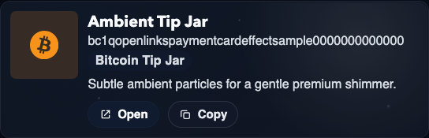
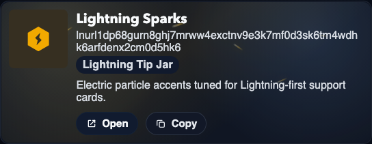
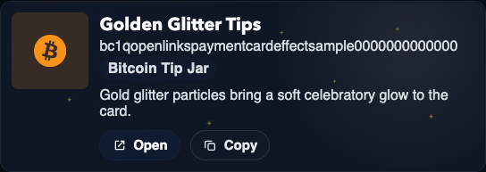
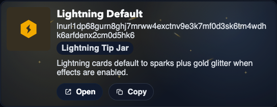

# Payment Card Effect Samples

These committed sample assets document the current payment-card effects and their configurable
`bombasticity` scale.

## Interactive sample route

Use the Easter egg route to scrub all sample cards at once:

- hidden alias: `/spark/tip-cards`
- internal capture route: `/__samples/payment-card-effects`

The page now exposes a single global bombasticity slider:

- `0.0` = no decorative effect layer
- `0.05` = roughly the old midpoint/default feel
- `0.1` = the loudest, fastest supported treatment
- `0.1..1.0` = intentionally plateau at the same maximum treatment

The route also supports query params for deterministic capture:

- `bombasticity=<0..1>`
- `fixture=<fixture-id>`
- `capture=1`

Example:

```text
/__samples/payment-card-effects?fixture=lightning-default-combo&bombasticity=0.08&capture=1
```

## Regenerating committed media

### Stable screenshots

```bash
bun run payment:effects:screenshots
```

The screenshot generator renders the internal sample route with reduced motion enabled so the
captured frames stay repeatable even though the live effects animate in the app.

### Short committed videos

```bash
bun run payment:effects:videos
```

The video generator writes short, low-resolution `.webm` clips under:

- `public/generated/payment-card-effects/videos/`

The committed video matrix covers each showcase fixture at:

- `0.03`
- `0.05`
- `0.08`
- `0.1`

## Stable screenshots

### Ambient particles



### Lightning particles



### Gold glitter particles



### Lightning default combo


